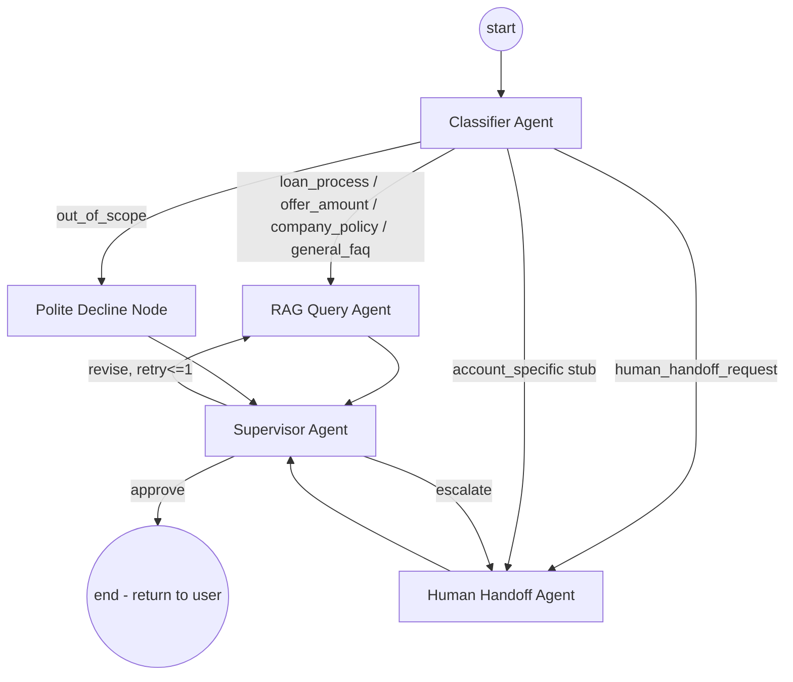
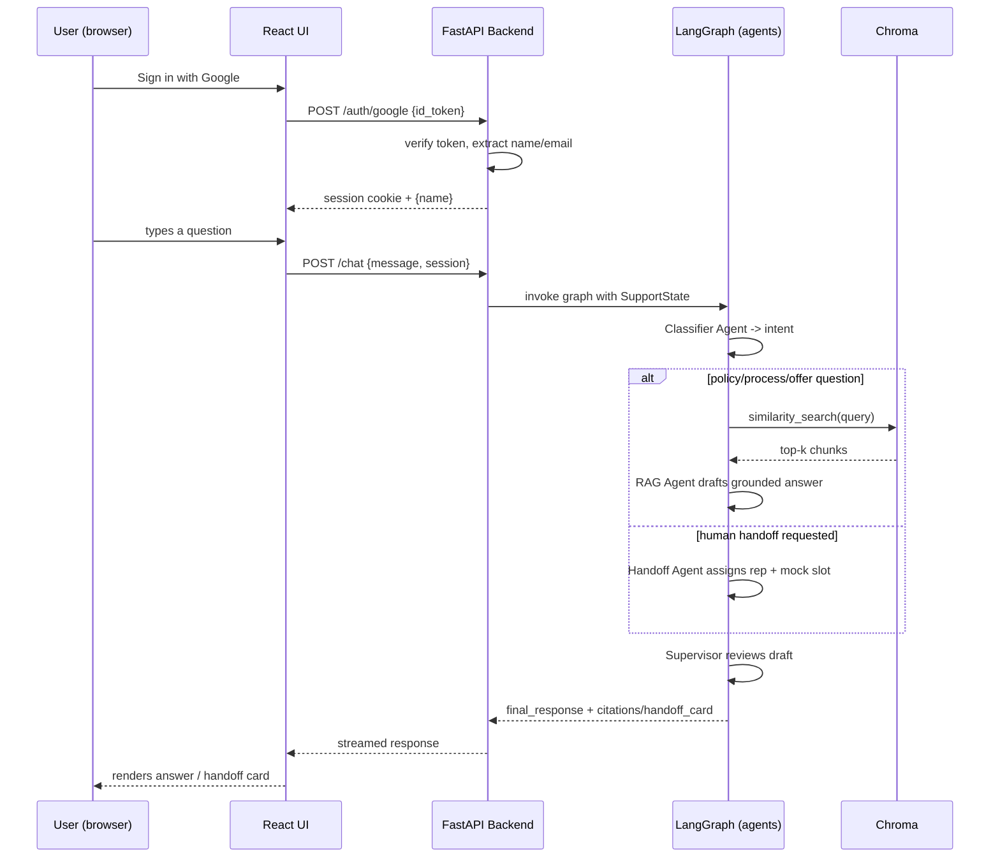

# 01 — System Architecture

Parent doc: [README.md](./README.md)

## 1. Component Overview

| Component | Responsibility | Lives where |
|---|---|---|
| React Chat UI | Google sign-in, chat interface, renders agent responses/citations/handoff cards | Frontend (Vercel / HF Static Space) |
| Backend API | Auth verification, session handling, invokes the agent graph, streams responses | FastAPI on Hugging Face Spaces (Docker) |
| Classifier Agent | First node in the graph; determines intent and routing | LangGraph node |
| RAG Query Agent | Answers static-data questions grounded in the policy knowledge base | LangGraph node |
| Human Handoff Agent | Assigns a real support person, produces a mock booking | LangGraph node |
| Supervisor / Guardrail Agent | Reviews every outbound response before it reaches the user | LangGraph node (terminal gate) |
| Vector DB (Chroma) | Stores embedded policy/FAQ chunks for retrieval | Embedded in backend process |
| Support Roster Store | Static JSON/SQLite table of mock support reps | Backend data file / SQLite |

## 2. Orchestration Graph (LangGraph)



Why LangGraph specifically: the routing here is conditional and cyclic (supervisor can send work *back* to the RAG agent for one revision, or forward it *sideways* to the handoff agent). A plain sequential chain can't express that; LangGraph's conditional edges + shared state object are built for exactly this.

## 3. Shared State Schema

All nodes read/write a single state object that flows through the graph (LangGraph `StateGraph` with a typed state):

```python
class SupportState(TypedDict):
    # Identity (populated by backend from verified Google ID token)
    user_name: str
    user_email: str

    # Conversation
    user_query: str
    chat_history: list[dict]  # prior turns, for follow-up context

    # Classifier output
    intent: Literal[
        "loan_process", "offer_amount", "company_policy",
        "general_faq", "human_handoff_request",
        "account_specific", "out_of_scope"
    ]
    intent_confidence: float
    extracted_entities: dict  # e.g. {"loan_type": "personal", "urgency": "high"}

    # RAG agent output
    retrieved_chunks: list[dict]  # [{content, source, score}]
    draft_response: str

    # Handoff agent output
    assigned_agent: dict | None  # {id, name, specialty, slot}
    handoff_record_id: str | None

    # Supervisor output
    supervisor_verdict: Literal["approve", "revise", "escalate"]
    supervisor_notes: str
    revision_count: int

    # Final
    final_response: str
    citations: list[str]
```

This single schema is the contract every agent doc below writes against — see each component doc for the fields it reads and writes.

## 4. Request Lifecycle (Sequence)



## 5. Backend API Surface

| Endpoint | Method | Purpose |
|---|---|---|
| `/auth/google` | POST | Accepts Google ID token, verifies server-side, creates session |
| `/chat` | POST | Accepts a user message + session, runs the agent graph, returns response (streamed via SSE or chunked) |
| `/chat/history` | GET | Returns current session's message history (in-memory or SQLite per session) |
| `/support/roster` | GET | (internal/admin use) Lists mock support reps — used for seeding/demo, not customer-facing |
| `/health` | GET | Liveness check for the hosting platform |

## 6. Deployment Topology

```
[React app] --(HTTPS)--> [FastAPI backend, Docker on HF Spaces]
                                |
                                |--> Groq API (LLM calls)
                                |--> Chroma (embedded, same container, persisted to disk)
                                |--> sentence-transformers (local embedding, same container)
                                |--> SQLite (session + handoff records, same container)
```

Everything runs in **one backend container** for v1 — no separate microservices. This is a deliberate simplicity choice for a learning project: it keeps the free-tier hosting story simple (one Space) while the *internal* code structure (agents as separate LangGraph nodes/modules) still demonstrates proper separation of concerns. If this were productionized, the natural next step is splitting the vector DB and session store into managed services — call this out explicitly in interviews as a known scaling seam, not a gap you missed.

## 7. Extensibility Principle (used throughout)

Every agent that needs external data calls a named **tool function**, never accesses data directly inline. This is what makes [07-data-model-extensibility.md](./07-data-model-extensibility.md) possible without rearchitecting:

- RAG Agent calls `search_policy_kb(query) -> list[Chunk]`
- Handoff Agent calls `find_available_rep(specialty) -> Rep`
- Future Account Data Agent will call `get_customer_loan_status(customer_id) -> LoanStatus` — same pattern, new tool, new node, one new conditional edge from the classifier. Nothing else in the graph changes.

## 8. Observability

Every graph invocation logs one structured JSON record per node transition (`node_name`, `input_summary`, `output_summary`, `latency_ms`, `timestamp`) to a local log file. This is intentionally low-tech (no external tracing service required to stay free-tier) but is what makes the eval harness in [08-evaluation-and-testing.md](./08-evaluation-and-testing.md) possible. LangSmith (has a free tier) is noted as an optional stretch upgrade if you want hosted trace visualization for demos.
