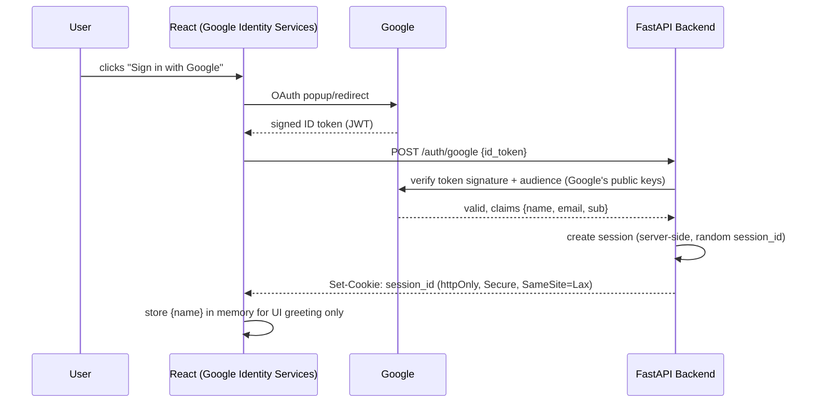

# 02 — Frontend: React UI + Google Authentication

Parent doc: [README.md](./README.md) | Architecture: [01-architecture.md](./01-architecture.md)

## 1. Purpose

The frontend has two jobs: (1) identify the user via Google Sign-In so the agent can address them by name and personalize responses, and (2) present the chat conversation, including two response types that plain chatbots don't have — **grounded answers with citations** and **human handoff cards**.

## 2. Why Google Auth (not a custom login)

- Zero password/credential handling — nothing to secure, nothing to leak. Appropriate for a learning project.
- Gives a verified name + email for free, which is exactly the identity data the agent needs ("Hi Rajesh, happy to help with your personal loan question").
- Directly sets up the extensibility path in [07-data-model-extensibility.md](./07-data-model-extensibility.md): the verified email becomes the join key to a future `customer_accounts` table.

## 3. Auth Flow



**Security notes (important even for a learning project — this is a "did you actually understand auth" signal in interviews):**
- Never trust the ID token's claims on the frontend for anything security-relevant — the backend must re-verify the token signature against Google's public keys before creating a session.
- Session token is an httpOnly cookie, not `localStorage` — avoids trivial XSS token theft.
- The frontend keeps only the display name in memory for greeting text; it never re-sends the raw Google ID token on subsequent requests, only the session cookie.

## 4. Tech Choices

| Concern | Choice | Why |
|---|---|---|
| Framework | React + Vite | Fast dev loop, no need for Next.js SSR complexity here |
| Google Sign-In | Google Identity Services (`@react-oauth/google` or vanilla GIS script) | Official, free, no backend SDK license needed |
| State management | React Context (or Zustand if state gets non-trivial) | Chat state is simple enough not to need Redux |
| Styling | Tailwind CSS | Fast to build a clean chat UI without custom CSS overhead |
| Streaming | Server-Sent Events (`EventSource`) or fetch stream reader | Matches FastAPI's streaming response for token-by-token feel |

## 5. UI Components

```
<App>
 ├─ <SignInScreen>            -- shown until authenticated
 ├─ <ChatLayout>               -- shown after sign-in
 │   ├─ <Header user={name} /> -- "Hi Rajesh" + sign-out
 │   ├─ <MessageList>
 │   │   ├─ <UserMessage />
 │   │   ├─ <AgentMessage citations={[...]} />   -- renders grounded answer + source pills
 │   │   ├─ <HandoffCard agent={...} slot={...} /> -- distinct card style, not a plain bubble
 │   │   └─ <TypingIndicator />
 │   └─ <ChatInput onSend={...} />
```

### Component notes

- **`<AgentMessage>`**: must visually distinguish a grounded answer (small "Source: Loan Eligibility Policy §2" pill under the text) from a generic reply. This is the UI expression of the groundedness requirement from the RAG agent — if there's no citation, something's wrong upstream and that should be visually obvious during your own testing too.
- **`<HandoffCard>`**: shows assigned rep's name, specialty, and mock time slot ("Priya Sharma, Loan Specialist — available today 3:30 PM"). Distinct card styling (not a chat bubble) signals "this is an action taken on your behalf," not just text.
- **`<TypingIndicator>`**: since the backend graph runs classifier → agent → supervisor sequentially, a real request takes a few seconds. Show a staged indicator ("Understanding your question…" → "Checking policy documents…") rather than a generic spinner — cheap to build, meaningfully better UX, and demonstrates you're thinking about multi-agent latency as a UX problem, not just a backend one.

## 6. API Contract (frontend ⇄ backend)

| Endpoint | Request | Response |
|---|---|---|
| `POST /auth/google` | `{ id_token: string }` | `{ name: string, email: string }` + session cookie |
| `POST /chat` | `{ message: string }` (session cookie carries identity) | Stream of `{ type: "token" \| "citation" \| "handoff" \| "done", data }` events |
| `GET /chat/history` | — | `{ messages: [...] }` |
| `POST /auth/logout` | — | clears session cookie |

## 7. Non-Goals for v1 Frontend

- No guest/anonymous mode — sign-in is required before chatting (keeps the "personalize by name" requirement simple and matches the real product intent).
- No message editing/regeneration UI, no multi-conversation history sidebar — single ongoing session per sign-in is enough to demonstrate the architecture.
