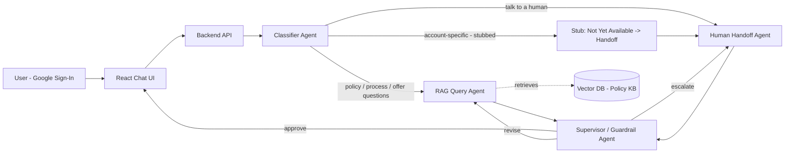

# Brightloan AI Support Agent — Product Requirements Document

**Status:** Draft v1
**Owner:** Rajesh
**Type:** Personal learning project (portfolio-grade, not a production system)
**Last updated:** 2026-07-25

> "Brightloan" is a made-up company name used throughout this PRD set since the project models a lending-company support use case. It's a placeholder for a personal/portfolio project — rename freely, nothing here depends on it.

---

## 1. Purpose

New applicants exploring a loan product typically ask the same handful of questions before they apply: *"What documents do I need?"*, *"What's the maximum loan amount I can get?"*, *"What's your interest rate / processing fee?"*, *"How long does approval take?"*. Today these are answered by a human support rep or a static FAQ page, both of which are slow (rep) or unhelpful for anything slightly non-standard (FAQ page).

This project builds an **AI support agent** that answers these pre-application questions instantly and accurately, grounded strictly in the company's actual policy documents (no hallucinated numbers), and — when a question can't be handled safely by AI, or the customer explicitly asks — hands the customer off to a real support person.

The purpose driving the design, not just "build a chatbot": **grounded accuracy on financial information is non-negotiable**. A support bot that invents an interest rate is worse than no bot at all. That constraint is why this system is a multi-agent pipeline with a dedicated supervisor/guardrail stage, rather than a single prompt-and-respond chatbot.

## 2. Goals

- Answer static, non-account-specific questions (loan process, eligibility, offer amounts/ranges, company policy, documentation requirements) accurately, with every claim traceable to a source document.
- Recognize when a customer wants a human and connect them to a specific real support person, not a generic "someone will call you."
- Demonstrate a genuine multi-agent architecture: classify → route → retrieve/act → supervise → respond, with each stage independently testable.
- Build an evaluation harness and guardrail test suite — the part that separates a "resume project" from a "weekend chatbot demo."
- Design the system so that **adding real per-customer account data later (loan status, EMI due, etc.) requires no architectural rework** — only a new tool + a new agent slotting into the existing graph.

## 3. Non-Goals (explicitly out of scope for v1)

- No real existing-customer account lookups (no live loan status, no EMI balance). This is a **reserved, stubbed** capability — see [07-data-model-extensibility.md](./07-data-model-extensibility.md).
- No real telephony/calendar booking (no actual Twilio calls, no real Google Calendar sync). Human handoff is **simulated** with a mock support-agent roster and mock scheduling.
- No production-scale traffic, load testing, or multi-tenant auth. Single-user demo scale, built on free-tier infrastructure.
- No mobile app — web only.

## 4. Users & Personas

| Persona | Description | What they need from this system |
|---|---|---|
| **New applicant (primary)** | Someone considering a Brightloan product, not yet a customer. Signs in with Google so the agent can greet them by name and remember context within the session. | Fast, trustworthy answers about the loan process and terms; an easy path to a human if the bot can't help. |
| **Existing customer (future, out of scope for v1)** | Already has an active loan. | Account-specific answers ("what's my EMI due date") — reserved for a future phase. |
| **Support rep (roster entry, not a live user of the app in v1)** | A real person modeled in the system's support-agent roster. | Gets assigned to handoff requests matching their specialty. In v1 this is data, not a live dashboard. |

## 5. System at a Glance

Full architecture, state schema, and sequence diagrams: [01-architecture.md](./01-architecture.md).

## 6. Document Index

| Doc | Covers |
|---|---|
| [01-architecture.md](./01-architecture.md) | End-to-end system architecture, agent orchestration graph, shared state schema, deployment topology |
| [02-frontend-react-auth.md](./02-frontend-react-auth.md) | React chat UI, Google OAuth sign-in, API contract |
| [03-classifier-agent.md](./03-classifier-agent.md) | Intent taxonomy, routing logic, classifier prompt design |
| [04-rag-query-agent.md](./04-rag-query-agent.md) | Knowledge base, ingestion pipeline, retrieval, grounded answer generation |
| [05-human-handoff-agent.md](./05-human-handoff-agent.md) | Support-agent roster, assignment logic, mock scheduling |
| [06-supervisor-guardrails-agent.md](./06-supervisor-guardrails-agent.md) | Response QA gate, guardrail rules, escalation/revision logic |
| [07-data-model-extensibility.md](./07-data-model-extensibility.md) | How the system extends to real customer-account data later |
| [08-evaluation-and-testing.md](./08-evaluation-and-testing.md) | Eval test set, guardrail adversarial tests, metrics to report |

## 7. Success Metrics (for a learning project)

Since there's no real user base, success is measured by **demonstrable correctness**, not usage numbers:

| Metric | Target | Why it matters |
|---|---|---|
| Classification accuracy on eval set | ≥ 90% | Wrong routing = wrong agent = bad answer |
| Groundedness (RAG answers trace to a real KB source) | ≥ 95% | The whole point of the project — no invented policy |
| Guardrail catch rate on adversarial test set | 100% on hard-blocked categories (e.g. "guarantee my loan approval") | Proves the guardrail layer isn't decorative |
| Human handoff success rate | 100% of "talk to a human" requests result in a named assignment | Core promised feature |
| End-to-end latency (p50) | < 6s for RAG answers | Free-tier LLM inference; acceptable for a demo, document if slower |

## 8. Tech Stack

| Layer | Choice | Notes |
|---|---|---|
| Frontend | React (Vite) + Google Identity Services | See [02](./02-frontend-react-auth.md) |
| Backend / API | FastAPI (Python) | Hosts the agent graph behind REST/streaming endpoints |
| Orchestration | LangGraph | Explicit state graph, conditional routing, matches the classifier→agent→supervisor flow directly |
| LLM | Groq (Llama 3.x) | Free tier, no card required, fast inference — see cost/limits notes in each agent doc |
| Embeddings | `sentence-transformers` (local, free) | Avoids burning LLM-provider free-tier quota on embedding calls |
| Vector DB | Chroma (embedded/local) | Free, zero-ops; Qdrant Cloud free tier as a swap-in if a "real" hosted DB is wanted |
| Auth | Google OAuth 2.0 (Google Identity Services) | Used only for identity (name/email), not for account data in v1 |
| Hosting | Hugging Face Spaces (backend, Docker) + Vercel/HF Static (frontend) | Both free-tier |

## 9. Build Order (MVP → complete)

1. **Knowledge base + RAG Query Agent** standalone (no auth, no other agents yet) — prove grounded retrieval works.
2. **Classifier Agent** — add intent routing in front of the RAG agent.
3. **Supervisor/Guardrail Agent** — insert as the mandatory gate before any response leaves the graph.
4. **Human Handoff Agent** — mock roster + assignment logic.
5. **React frontend + Google Auth** — wire the UI to the now-complete backend graph; personalize using the user's name.
6. **Evaluation harness + guardrail adversarial tests** — the deliverable that makes this a credible resume artifact, not a demo toy.
7. **(Stretch)** Stub the `account_specific` intent path per [07](./07-data-model-extensibility.md) to prove extensibility without building the real feature.
